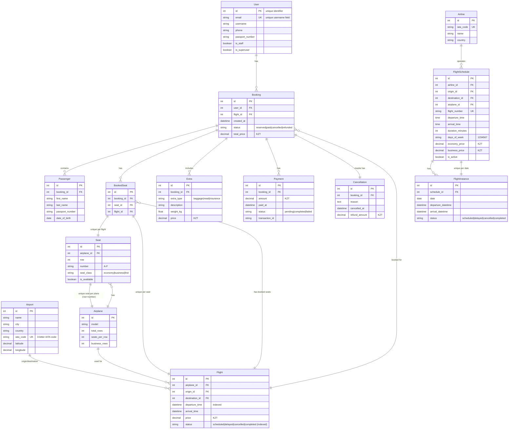

# AeroBook ER Diagram (Mermaid)

## Legend for Relationships:
- `||--o{`: One to Many
- `||--||`: One to One
- `||--||`: One to One (with unique constraint)

## Key Unique Constraints Highlighted:
- `BookedSeat`: `(seat, flight)` → Prevent double-booking!
- `Seat`: `(airplane, row, number)` → Prevent duplicate seats on same plane!
- `FlightInstance`: `(schedule, date)` → One instance per schedule per date!
